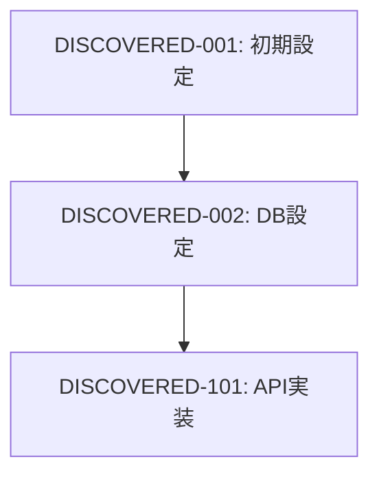

# Name: rev-tasks

---

# Description: 既存のコードベースを分析し、実装されている機能を特定してタスク一覧として整理します。リバースエンジニアリングの最初のステップ。

---

# Content

## 目的

既存のコードベースを分析し、実装されている機能を特定してタスク一覧として整理する。実装済みの機能から逆算してタスクの構造、依存関係、実装詳細を抽出し、文書化する。

## 前提条件

- 分析対象のコードベースが存在する
- `docs/reverse/` ディレクトリが存在する（なければ作成）

## 実行内容

1. **コードベースの構造分析**
   - ディレクトリ構造の把握
   - 設定ファイルの確認（言語に応じた設定ファイル）
   - 依存関係の分析

2. **機能コンポーネントの特定**
   - フロントエンドコンポーネント
   - バックエンドサービス/コントローラー
   - データベース関連（モデル、マイグレーション）
   - ユーティリティ関数
   - ミドルウェア

3. **API エンドポイントの抽出**
   - REST API / gRPC / GraphQL エンドポイント
   - ルーティング定義

4. **データベース構造の分析**
   - テーブル定義
   - リレーションシップ
   - マイグレーションファイル

5. **テスト実装の確認**
   - 単体テストの存在
   - 統合テストの存在
   - E2Eテストの存在

6. **タスクの逆算と整理**
   - 実装された機能をタスクとして分解
   - タスクIDの自動割り当て
   - 依存関係の推定

7. **ファイルの作成**
   - `docs/reverse/{プロジェクト名}-discovered-tasks.md` として保存

## 言語別の分析対象ファイル

| 言語 | 設定ファイル | ソースファイル | テストファイル |
|------|-------------|---------------|---------------|
| Go | `go.mod`, `go.sum` | `*.go` | `*_test.go` |
| Rust | `Cargo.toml` | `*.rs` | `tests/*.rs` |
| Python | `pyproject.toml`, `requirements.txt` | `*.py` | `test_*.py` |
| TypeScript | `package.json`, `tsconfig.json` | `*.ts`, `*.tsx` | `*.test.ts` |
| Java | `pom.xml`, `build.gradle` | `*.java` | `*Test.java` |

## 出力フォーマット例

```markdown
# {プロジェクト名} 発見タスク一覧

## 概要

**分析日時**: {分析実行日時}
**対象コードベース**: {パス}
**発見タスク数**: {数}
**推定総工数**: {時間}

## コードベース構造

### プロジェクト情報
- **言語**: {使用言語}
- **フレームワーク**: {使用フレームワーク}
- **データベース**: {使用DB}
- **主要ライブラリ**: {主要な依存関係}

### ディレクトリ構造
```
{ディレクトリツリー}
```

## 発見されたタスク

### 基盤・設定タスク

#### DISCOVERED-001: プロジェクト初期設定

- [x] **タスク完了** (実装済み)
- **タスクタイプ**: DIRECT
- **実装ファイル**: 
  - [設定ファイル一覧]
- **実装詳細**:
  - {発見された設定内容}
- **推定工数**: {時間}

### API実装タスク

#### DISCOVERED-101: [API名]

- [x] **タスク完了** (実装済み)
- **タスクタイプ**: TDD
- **実装ファイル**: 
  - [実装ファイル一覧]
- **APIエンドポイント**:
  - [エンドポイント一覧]
- **テスト実装状況**:
  - [x] 単体テスト: [ファイル名]
  - [ ] 統合テスト: 未実装
  - [ ] E2Eテスト: 未実装
- **推定工数**: {時間}

## 未実装・改善推奨事項

### 不足しているテスト
- [ ] {不足テストの説明}

### コード品質改善
- [ ] {改善点}

### ドキュメント不足
- [ ] {不足ドキュメント}

## 依存関係マップ



## 技術的負債・改善点

### パフォーマンス
- {発見されたパフォーマンス課題}

### セキュリティ
- {発見されたセキュリティ課題}

### 保守性
- {発見された保守性課題}
```

## 実行後の確認

- 発見されたタスク数と推定工数を表示
- 実装済み/未実装の機能一覧を表示
- 技術的負債・改善推奨事項をサマリー表示
- 次のリバースエンジニアリングステップ（設計書生成等）を提案

## 次のステップ

`/rev-design` で設計文書を逆生成してください。
